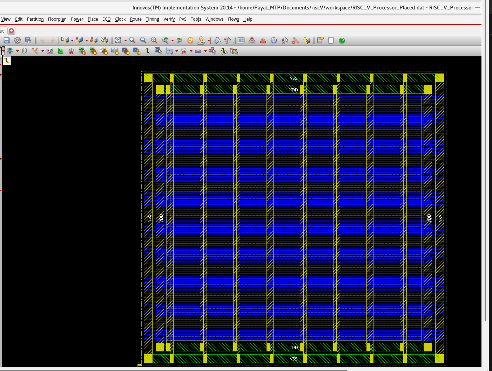
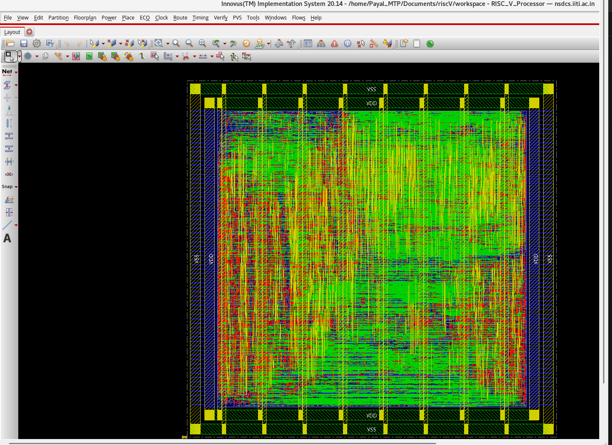
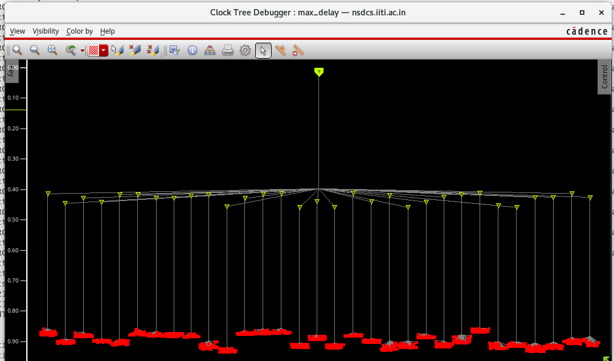
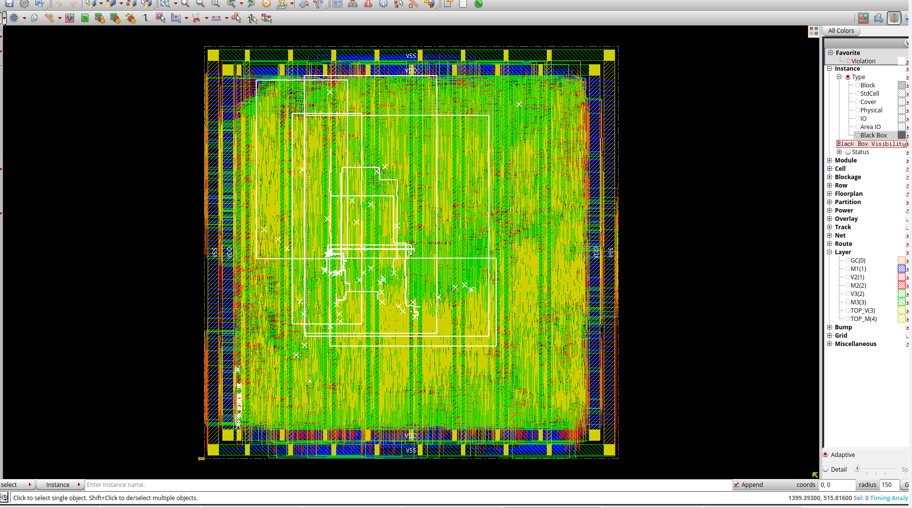

# RISC-V Single-Core Pipelined Processor

## Goal

To design and implement a 32-bit RISC-V single-core pipelined processor take the design through a complete digital ASIC implementation flow, from RTL development and verification to physical implementation and GDSII stream-out.

The project combines processor microarchitecture with practical ASIC design using Cadence tools and an SCL 180 nm technology.

---

## Project Overview

This project implements a **32-bit RV32I RISC-V processor** using a classic **5-stage pipeline**:

1. Instruction Fetch (IF)
2. Instruction Decode (ID)
3. Execute (EX)
4. Memory Access (MEM)
5. Write Back (WB)

The processor is organised as a modular RTL design, with separate blocks for the major processor functions and pipeline registers between stages.

The project was subsequently taken through synthesis and physical implementation to demonstrate the complete RTL-to-GDSII flow.

---

# 1. Processor Architecture

The processor implements the RV32I base integer instruction set.

The major instruction classes supported by the design are:

- R-type
- I-type
- J-type

The processor contains the datapath, control logic, register file, ALU, instruction-fetch logic, memory-access logic and pipeline control required for a five-stage implementation.

---

## 1.1 Processor Datapath

The processor datapath contains the major computational and storage elements required for instruction execution.

The main functional blocks include:

- Program Counter
- Instruction Fetch
- Instruction Decode
- Register File
- Immediate Generation
- ALU
- Control Unit
- Data Memory Interface
- Pipeline Registers
- Forwarding Logic
- Hazard Detection Logic

The processor modules are connected through pipeline registers so that multiple instructions can be processed concurrently.

---

# 2. Five-Stage Pipeline

The instruction execution cycle is divided into five stages.

### 1. IF — Instruction Fetch

The Instruction Fetch stage:

- Maintains the program counter.
- Fetches the instruction associated with the current PC.
- Generates the next sequential PC.
- Supports control-flow redirection from branch and jump decisions.

### 2. ID — Instruction Decode

The Instruction Decode stage:

- Decodes the instruction.
- Reads source operands from the register file.
- Generates control signals.
- Generates the required immediate value.
- Prepares operands and control information for the EX stage.

### 3. EX — Execute

The Execute stage:

- Performs ALU operations.
- Calculates effective addresses.
- Performs arithmetic and logical operations.
- Resolves branch conditions.

### 4. MEM — Memory Access

The Memory stage:

- Performs load operations.
- Performs store operations.
- Transfers the required data between the processor datapath and memory.

### 5. WB — Write Back

The Write Back stage:

- Selects the appropriate result.
- Writes the result into the destination register.
- Completes the instruction execution.

---

# 3. Hazard Handling

Pipeline execution introduces data and control hazards. The processor therefore incorporates dedicated mechanisms to maintain correct execution.


---

# 4. RTL Verification

Before physical implementation, the RTL design was evaluated through simulation and RTL quality checks.

## 4.1 RTL Simulation

RTL functional simulation was performed using **Cadence Xcelium**.

The simulation environment was used to examine processor behaviour and verify instruction execution.

---

## 4.2 RTL Linting

**Cadence JasperGold SuperLint** was used for RTL structural and coding checks.

The linting stage was used to identify RTL issues before synthesis.

---

## 4.3 Clock-Domain-Crossing Analysis

CDC analysis was performed using **JasperGold CDC**.

This stage was used to examine clock-domain interactions in the design.

---

## 4.4 X-Propagation Analysis

X-propagation behaviour was also analysed during verification.

The purpose was to understand the propagation of unknown values through the processor datapath and identify cases requiring attention during simulation.

---

# 5. ASIC Design Flow

After RTL verification, the processor was taken through the ASIC implementation flow.

```text
RTL Design
     │
     ▼
RTL Simulation
     │
     ▼
Lint / CDC
     │
     ▼
Logic Synthesis
     │
     ▼
Logic Equivalence
     │
     ▼
Floorplanning
     │
     ▼
Power Planning
     │
     ▼
Placement
     │
     ▼
Clock Tree Synthesis
     │
     ▼
Post-CTS Optimisation
     │
     ▼
Routing
     │
     ▼
Post-Route Timing Analysis
     │
     ▼
ECO Optimisation
     │
     ▼
Physical Verification
     │
     ▼
GDSII Stream-Out
```

---

# 6. Technology and EDA Tools

## Technology

- **SCL 180 nm**
- Standard-cell based ASIC implementation

## Tools

| Tool | Purpose |
|---|---|
| Cadence Xcelium | RTL simulation |
| Cadence JasperGold SuperLint | RTL linting |
| Cadence JasperGold CDC | CDC analysis |
| Cadence Genus | Logic synthesis |
| Cadence Innovus | Physical implementation |
| Cadence Innovus / sign-off utilities | Timing and physical verification |

---

# 7. Logic Synthesis — Cadence Genus

The verified RTL was synthesised using **Cadence Genus**.

The synthesis stage transformed the RTL description into a technology-mapped gate-level implementation.

The major synthesis activities included:

- RTL elaboration
- Technology mapping
- Timing analysis
- Area analysis
- Gate-level netlist generation

The synthesised netlist was subsequently used as the input for physical implementation.

---

# 8. Logic Equivalence

Logic equivalence checking was incorporated into the ASIC flow to compare the RTL and synthesised representations.

The purpose was to verify that synthesis preserved the intended logical behaviour of the processor.

---

# 9. Floorplanning

The synthesised design was imported into **Cadence Innovus** for physical implementation.

The floorplanning stage established the physical environment for the processor core, including:

- Core boundary
- Die boundary
- Placement region
- Routing resources
- Standard-cell placement area

The utilisation target was selected to provide an appropriate balance between cell density, timing and routing resources.

---

# 10. Power Planning

Power planning was performed using dedicated VDD and VSS structures.

The power distribution network included:

- VDD power ring
- VSS power ring
- Vertical power stripes
- Core-level power distribution

<p align="center">
  
</p>

<p align="center">
  <em>Powerplanning in Cadence Innovus</em>
</p>
---

# 11. Placement

Standard cells were placed within the defined core area using Cadence Innovus.

Placement optimisation considered:

- Cell density
- Timing
- Congestion
- Routing resources
- Power distribution

The placed design was then taken forward to clock-tree synthesis.
<p align="center">
  
</p>

<p align="center">
  <em>Placement in Cadence Innovus</em>
</p>
---

# 12. Clock Tree Synthesis

Clock Tree Synthesis (CTS) was performed using **Cadence Innovus**.

The objective of CTS was to construct a balanced clock distribution network while controlling clock skew and transition.

The CTS stage included:

- Clock-tree construction
- Clock buffering
- Clock skew control
- Clock transition control
- Timing-driven optimisation

<p align="center">
  
</p>

<p align="center">
  <em>Clock Tree Synthesis in Cadence Innovus</em>
</p>
---

# 13. Post-CTS Optimisation

Following CTS, timing-driven optimisation was performed before detailed routing.

The optimisation stage considered:

- Setup timing
- Hold timing
- Clock-tree effects
- Cell sizing
- Buffer insertion
- Placement and congestion

The resulting implementation was taken forward to routing.

---

# 14. Routing

Detailed routing was performed using **Cadence Innovus**.

The routing stage established the physical interconnect between the placed standard cells and clock structures.

<p align="center">
  
</p>

<p align="center">
  <em>Post-Route Layout in Cadence Innovus</em>
</p>
The routed design was then analysed for timing and physical implementation characteristics.

---

# 15. Post-Route Timing Analysis

Post-route timing analysis was performed on the physically implemented design.

The analysis considered:

- Setup timing
- Hold timing
- Register-to-register paths
- Clock paths
- Transition
- Capacitance
- Fanout

Critical paths identified during this stage were used to guide post-route optimisation.

---

# 16. Post-Route ECO

A targeted Engineering Change Order (ECO) was performed to optimise a critical timing path.

The critical cell was resized in Innovus using:

```tcl
ecoChangeCell -inst g160500 -cell oan211d4
```

The cell was changed from:

```text
oan211d1  →  oan211d4
```

This provided a targeted post-route timing optimisation without changing the processor architecture.

---

# 17. Physical Verification

The completed physical implementation was taken through the final physical verification stage.

The physical implementation flow included:

- Post-route timing analysis
- Setup and hold analysis
- Connectivity verification
- Design-rule verification
- Final implementation database checks

This project represents a **core-level ASIC implementation**. Top-level pad cells and external IO-cell integration were outside the scope of the project.

---

# 18. GDSII Stream-Out

The final physical database was successfully streamed out to **GDSII**.

The stream-out represents the final physical database generated from the implemented processor core.

### GDSII Summary

| Parameter | Result |
|---|---:|
| GDS Version | 3 |
| Database Units | 1000 DBU |
| Instances | 17,099 |
| Nets | 240,300 |
| Via Instances | 145,537 |
| Special Nets | 459 |
| Text Objects | 17,898 |
| Metal Layers | M1, M2, M3, TOP_M |
| Metal Fill | 0 |

Because this is a core-level implementation rather than a complete chip top level, top-level pad and IO pins are outside the scope of the design.

---

# 19. Final Implementation Flow

The complete implementation achieved the following flow:

```text
                    RISC-V RTL
                        │
                        ▼
              RTL Verification
                        │
                        ▼
                Genus Synthesis
                        │
                        ▼
             Logic Equivalence
                        │
                        ▼
                Floorplanning
                        │
                        ▼
               Power Planning
                        │
                        ▼
                  Placement
                        │
                        ▼
             Clock Tree Synthesis
                        │
                        ▼
             Post-CTS Optimisation
                        │
                        ▼
                    Routing
                        │
                        ▼
            Post-Route Analysis
                        │
                        ▼
                 ECO Optimisation
                        │
                        ▼
             Physical Verification
                        │
                        ▼
                 GDSII Stream-Out
```

---


# 20. Key Implementation Work

The project provided hands-on implementation experience across both processor RTL and ASIC physical design.

Major work included:

- RV32I processor implementation
- Five-stage pipeline architecture
- Pipeline register design
- Data forwarding
- Load-use hazard handling
- Branch flushing
- RTL simulation
- JasperGold SuperLint
- JasperGold CDC
- X-propagation analysis
- Cadence Genus synthesis
- Logic equivalence checking
- Innovus floorplanning
- VDD/VSS power planning
- Standard-cell placement
- Clock Tree Synthesis
- Post-CTS optimisation
- Detailed routing
- Post-route timing analysis
- Timing-driven ECO
- Physical verification
- GDSII stream-out

---

# 21. Learning Outcomes

Through this project, the following concepts were studied and implemented:

- RISC-V processor microarchitecture
- Five-stage instruction pipelining
- Pipeline data and control hazards
- Forwarding and stall mechanisms
- RTL verification
- Logic synthesis
- Timing analysis
- ASIC floorplanning
- Power planning
- Standard-cell placement
- Clock-tree synthesis
- Physical routing
- Post-route timing optimisation
- ECO implementation
- Physical verification
- GDSII generation

The project provided an end-to-end view of how a processor moves from an RTL description to a physical ASIC implementation.

---

# 22. Project Status

**RTL Design → Verification → Synthesis → Physical Design → Post-Route Optimisation → Physical Verification → GDSII Stream-Out**

**Final Deliverable:** GDSII physical implementation of the RISC-V processor core.
